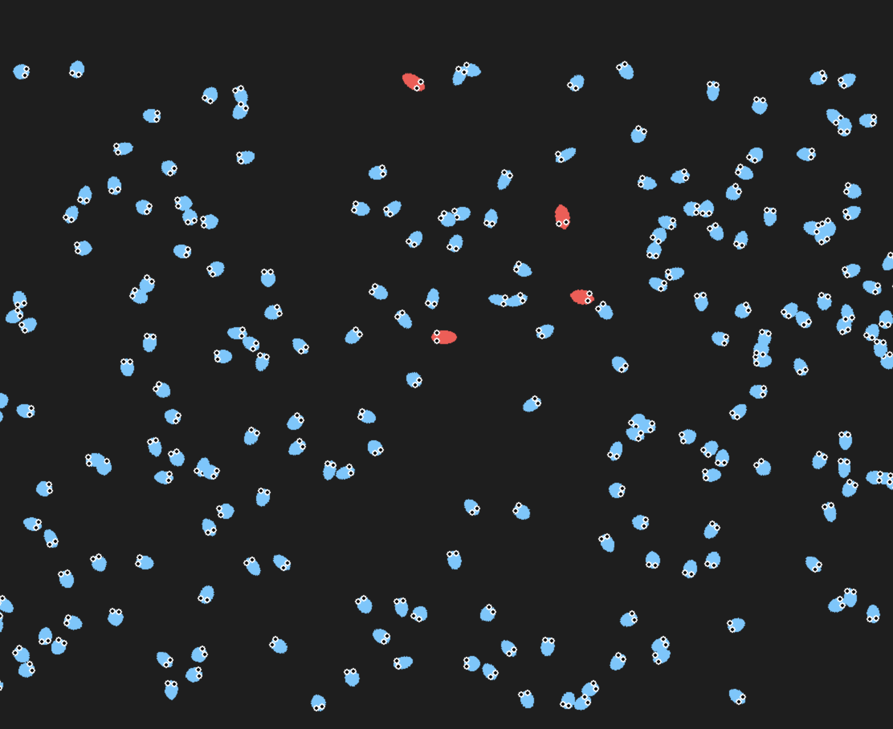
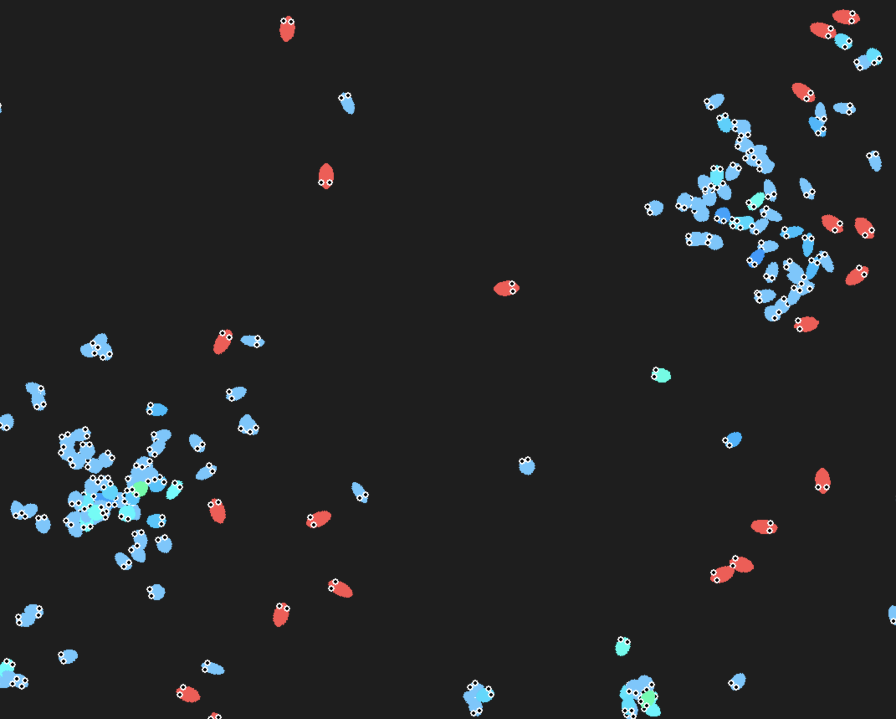

# Predator-Prey Ecosystem Simulator

A dynamic 2D simulation of a digital ecosystem where predators and prey interact, compete, and evolve over time. This simulation models natural selection by giving each entity a neural network brain that mutates across generations. Entities learn to hunt, escape, and survive based purely on evolutionary pressure.

This project is a practical exploration of how simple rules can lead to complex behaviors, echoing the principles of evolution and natural selection. It serves as a foundation for studying emergent AI behaviors and genetic algorithms.

---

## How It Works

Each **prey** and **predator** is controlled by a small feed-forward neural network. These networks take in "vision" inputs (raycast distances and threat/target data) and output two values:

- Turning direction (angular velocity)
- Movement speed (forward velocity)

Over time, entities that survive and reproduce pass down their neural network weights with slight mutations. Prey evolve better evasive tactics. Predators learn to pursue more efficiently.

---

## Key Features

- **Evolving Neural Networks**  
  Each entity has a unique brain that mutates upon reproduction. Each entity has a small chance to mutate a "gene" upon reproduction. These mutations are passed down to the next generations.

- **Raycasting Vision System**  
  Entities detect other nearby entities via directional rays, simulating field of view.

- **Natural Selection**  
  Only the fittest survive. Reproduction is energy-based and limited by environmental pressure.

- **Visual Debugging**  
  Toggle vision rays and entity status panels to analyze behavior and learning.

---

## Screenshots

The start of the simulation. The prey are blue and the predators are red. Prey and preditors are not very aware of each other. Those that are able to reproduce learn and pass that knowledge to their offspring.


The simulation after a few generations. The prey are now more aware of the predators and the predators are more aware of the prey. The prey are able to escape and the predators are able to hunt.


## Requirements

- Python 3.10+
- pygame
- numpy
- numba (for raycasting acceleration)
- py-spy (optional, for performance profiling)

Install dependencies:

```
pip install -r requirements.txt
```

---

## Running the Simulation

```bash
python main.py
```

You can tweak population sizes, energy costs, neural network complexity, and mutation rates in the appropriate configuration files and entity classes.

---

## Evolutionary Parameters

These parameters drive long-term learning and can be customized:

- `MUTATION_RATE` – Probability of random changes in brain weights.
- `ENERGY_REGEN_RATE` – Affects how quickly prey can reproduce.
- `MAX_ENERGY` – Determines how long an entity can survive.
- `SPEED_MUTATION_STDDEV` – Controls variance in offspring movement speed.
- `NEURAL_INPUTS` – Includes danger level, field of view, and detection status.

---

## Research and Learning Value

This project demonstrates the emergence of intelligent behaviors through simple neural structures and environmental pressure. It's especially suitable for:

- Studying **emergent AI** without supervised learning
- Experimenting with **genetic algorithms** and **mutation-driven evolution**
- Visualizing how different **fitness strategies** compete and dominate

---
